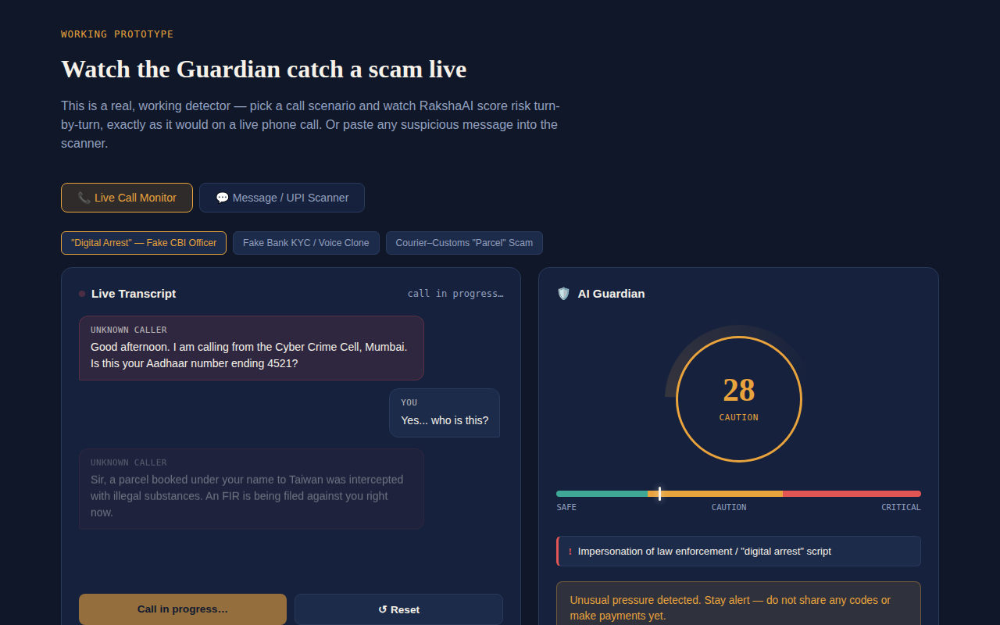
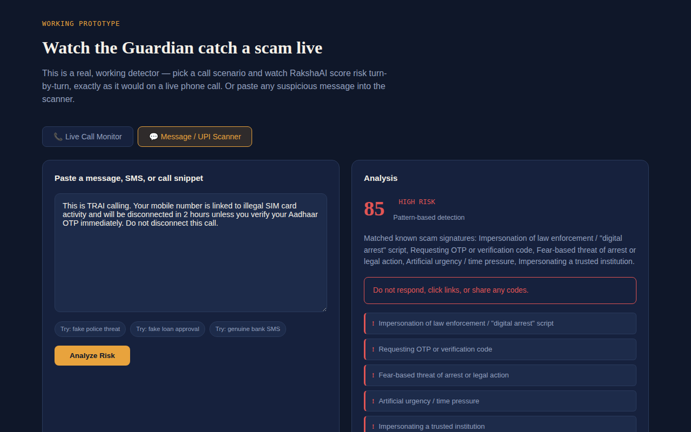
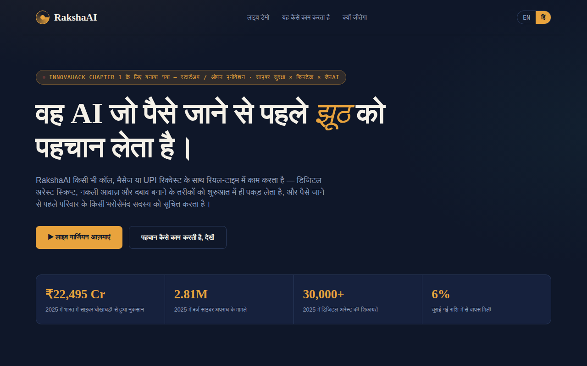

# RakshaAI 🛡️

### The AI that listens for the lie, before you pay the price.

RakshaAI is a real-time AI guardian that detects digital-arrest scams, voice-cloning fraud, and UPI social-engineering during a live call or message — and alerts a trusted family member before money moves.

Built for **InnovaHack Chapter 1**, Round 1 Submission.
**Domain:** Startup / Open Innovation *(built on Cybersecurity · FinTech · Generative AI)*

**Team Moho Maya** — Arpan Ghosh (Team Leader) · Asmita Karmakar

<p>
  <a href="https://rakshaai-psi.vercel.app/"></a>
  <a href="https://youtu.be/nftcpJoiZsQ"></a>
  <a href="https://github.com/Arpanthebaap/rakshaai"></a>
</p>

| | |
|---|---|
| 🔴 **Live Demo** | [rakshaai-psi.vercel.app](https://rakshaai-psi.vercel.app/) |
| 🎬 **Demo Video** | [youtu.be/nftcpJoiZsQ](https://youtu.be/nftcpJoiZsQ) |
| 💻 **GitHub Repo** | [github.com/Arpanthebaap/rakshaai](https://github.com/Arpanthebaap/rakshaai) |

---

## The problem

- **₹22,495 crore** lost to cyber fraud in India in 2025 alone — 2.81 million reported cases, up 24% year-on-year
- **30,000+ digital-arrest complaints** filed in 2025; over **₹4,057 crore** lost to this scam type since 2022
- Victims recover, on average, just **6%** of what they lose
- A 92-year-old in Delhi lost ₹2 crore. A Bengaluru software engineer lost ₹11.8 crore. A retired teacher was manipulated over 2.5 months into transferring ₹24 crore across 26 transactions.

Generative AI now lets scammers clone a familiar voice and write context-perfect scripts. India's UPI rails move money irreversibly in seconds — there's no fraud-hold window. And the fastest-growing pool of targets is first-time digital users in Tier-2/3 India and the elderly, exactly the users least equipped to verify a call mid-panic.

Nothing today intervenes **during** the call, when the scam is actually being constructed. RakshaAI does.

## What it does

| | |
|---|---|
| 🔍 **Detect** | Recognizes digital-arrest scripts, impersonation, urgency/secrecy pressure, and OTP/fund-transfer requests as a conversation unfolds — turn by turn, not after the fact |
| 💬 **Explain** | Surfaces the exact red flag in plain language, in the caller's own language |
| 🔔 **Protect** | Above a risk threshold, alerts a pre-set family guardian with live context, before any transfer happens |

## Screenshots

**Live risk dashboard** — a simulated digital-arrest call scored turn-by-turn:



**Message / UPI scanner** — paste any suspicious text for instant analysis:



**Fully bilingual** — every label, live call script, and AI response switches to Hindi, not just the UI chrome:



## How it works

A pure LLM call on every second of audio is too slow and too fragile to trust mid-conversation, and fails completely offline — unacceptable for rural users with unreliable connectivity. RakshaAI blends two layers:

```
 1. Capture              2. Heuristic Pass         3. LLM Reasoning          4. Act
 ───────────────         ───────────────────       ──────────────────       ─────────────────────
 Live call audio    →    <50ms offline pattern  →   Claude analyzes full →  On-screen warning +
 or pasted text          engine — works with        conversational          one-tap family
                          zero network               intent, catches         guardian alert
                                                      novel/multilingual
                                                      scripts
```

The two scores blend for a final risk reading, so the system degrades gracefully — it keeps protecting users even with no network, and gets sharper whenever connectivity is available.

## Tech stack

- **Frontend:** Vanilla HTML/CSS/JS — zero build tooling, fast to iterate under hackathon time pressure
- **Detection engine:** Client-side heuristic pattern-matching (bilingual EN/HI signatures)
- **AI reasoning layer:** [Claude](https://www.anthropic.com) (Anthropic API) for semantic scam-pattern analysis, called through a serverless proxy so the API key never reaches the browser
- **Backend:** Vercel serverless functions
- **Hosting:** Vercel

## Project structure

```
rakshaai/
├── public/
│   └── index.html        → the full app: dashboard, call simulator, scanner, EN/HI i18n
├── api/
│   └── analyze.js         → serverless function, proxies transcript text to Claude
├── screenshots/           → images used in this README
├── vercel.json             → routes /api/analyze to the function, everything else to public/
├── package.json
└── DEPLOY.md               → step-by-step deployment guide
```

## Getting started (local)

No build step — it's a static site.

```bash
git clone https://github.com/Arpanthebaap/rakshaai.git
cd rakshaai
open public/index.html      # macOS — or just double-click the file
```

The offline heuristic engine works immediately with no setup. The AI reasoning layer needs the backend running — see below.

## Deployment

Already live at **[rakshaai-psi.vercel.app](https://rakshaai-psi.vercel.app/)**, deployed on Vercel with the serverless proxy in `api/analyze.js`.

To deploy your own copy, see **[DEPLOY.md](./DEPLOY.md)** — takes about 5 minutes on Vercel's free tier. You'll need an Anthropic API key from [console.anthropic.com](https://console.anthropic.com/settings/keys), set as the `ANTHROPIC_API_KEY` environment variable (never commit it to the repo).

## Roadmap

- [x] Working web prototype — heuristic engine + LLM reasoning layer
- [x] Full English / Hindi localization, including live call scripts and AI responses
- [x] Message / UPI request scanner
- [x] Family guardian alert simulation
- [ ] Android accessibility-service integration for real live-call audio
- [ ] On-device speech-to-text for fully offline use
- [ ] Bank / telecom pilot partnerships
- [ ] Expand to 6+ Indian languages
- [ ] Verified one-tap reporting to 1930 / cybercrime.gov.in (NCRP)
- [ ] Voice-clone detection on the audio itself, not just conversation content
- [ ] Insurer risk-scoring API

## Business model

| | |
|---|---|
| **Consumer app** | Free tier for individuals and families; freemium multi-guardian and multilingual voice alerts |
| **Bank / NBFC licensing** | White-labelled fraud-prevention layer, aligned with RBI's push for proactive fraud controls on UPI rails |
| **Telecom integration** | Caller-risk scoring layer, similar to today's spam-call flags |
| **Insurer partnerships** | Cyber-fraud insurance priced using RakshaAI's real-time risk signal as an underwriting input |

## Data sources

Fraud and loss figures cited in this project are drawn from India's National Cyber Crime Reporting Portal (NCRP) / I4C data as reported through 2025–2026 news coverage, including the Supreme Court's 2025 estimate on digital-arrest losses.

## Team

**Moho Maya**
- Arpan Ghosh — Team Leader
- Asmita Karmakar

## License

Built for InnovaHack Chapter 1. All rights reserved by the team pending event terms.
